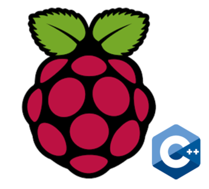

# Infineon Hardware Peripherals Software Libraries

Quick links to Infineon sensors, actuators and application specific ICs software resources on GitHub.

**Each icon is a link :link: !** Click on them to go to the related repo :rocket: 

Find more about the repository content type in the [Icon Links Glosssary](#Icons-Link-Glossary).

## Magnetic Sensors

<table>
    <tr>
        <td><b>3D Magnetic Sensors</b></td>
        <td><b>Hall Switches</b></td>
        <td><b>Angle Sensors</b></td>
    </tr>
    <tr>
        <td>
            <table>
                <tr>
                    <td> TLx493D-A1B6 </td>
                    <td>
                        
                        
                    </td>
                </tr>
                <tr>
                    <td> TLx493D-A2B6  
                         TLx493D-W2B6 </td>
                    <td></td>
                </tr>
                <tr>
                    <td> TLx493D-W2BW </td>
                    <td></td>
                </tr>
                <tr>
                    <td> TLx493D family </td>
                    <td>
                        
                        
                    </td>
                </tr>
            </table>
        </td>
        <td>
            <table>
                <tr>
                    <td> TLE4964-3M </td>
                    <td>
                        
                        
                        
                        
                    </td>
                </tr>
                    <tr>
                    <td> TLE4922 </td>
                    <td>                        
                        
                        </td>
                </tr>
                <tr>
                    <td> TLx4966 </td>
                    <td></td>
                </tr>
                <tr>
                    <td> hall-switch family </td>
                    <td>                        
                        
                        </td>
                </tr>
            </table>
        </td>
        <td>
            <table>
                <tr>
                    <td> TLE5012B </td>
                    <td> 
                        
                    </td>
                </tr>
            </table>
        </td>
    </tr>
</table>

## Environmental Sensors

<table>
    <tr>
        <td><b>Digital Pressure Sensors </b></td>
        <td><b>Gas Sensors</b></td>
    </tr>
    <tr>
        <td>
            <table>
                <tr>
                    <td> DPS310 </td>
                    <td>  </td>
                </tr>
                <tr>
                    <td> DPS368 </td>
                    <td>  </td>
                </tr>
                <tr>
                    <td> DPS422 </td>
                    <td>  </td>
                </tr>
               <tr>
                    <td> DPS family </td>
                    <td> </a> </td>
                </tr>
            </table>
        </td>
        <td>
            <table>
                <tr>
                    <td> PAS XENSIV™ CO2 </td>
                    <td> Coming soon! </td>
                </tr>
            </table>
        </td>
    </tr>
</table>

## Audio Amplifiers & MEMS Microphones

<table>
    <tr>
        <td><b>MEMS Microphones</b></td>
        <td><b>Audio Amplifiers</b></td>
    </tr>
    <tr>
        <td>
            <table>
                <tr>
                    <td> IM69D130 </td>
                    <td>
                        
                        
                    </td>
                </tr>
            </table>
        </td>
        <td>
            <table>
                <tr>
                    <td> MERUS™ Audio Amp </td>
                    <td>  
                        
                        
                    </td>
                </tr>
            </table>
        </td>
    </tr>
</table>

## Motor Controllers

<table>
    <tr>
        <td><b>DC</b></td>
        <td><b>Brushless DC</b></td>
        <td><b>Stepper</b></td>
    </tr>
    <tr>
        <td>
            <table>
                <tr>
                    <td> TLE94112EL </td>
                    <td> <a href="https://github.com/Infineon/DC-Motor-Control-TLE94112EL">
                    </td>
                </tr>
                <tr>
                    <td> BTN8982TA </td>
                    <td>  </td>
                </tr>
            </table>
        </td>
        <td>
            <table>
                <tr>
                    <td> TLE9879 </td>
                    <td>  </td>
                </tr>
                <tr>
                    <td> IFX007T </td>
                    <td>  </td>
                </tr>
                <tr>
                    <td> TLE9471-3ES </td>
                    <td> </a> </td>
                </tr>
            </table>
        </td>
        <td>
            <table>
                <tr>
                    <td> IFX9201 </td>
                    <td> </td>
                </tr>
            </table>
        </td>
    </tr>
</table>

## Security Controllers

<table>
    <tr>
        <td><b>OPTIGA™ Trust</b></td>
        <td><b>SECORA™ </b></td>
        <td><b>TPM</b></td>
    </tr>
    <tr>
        <td>
            <table>
                <tr>
                    <td> OPTIGA™ Trust M </td>
                    <td>
                        
                         
                         
                        <a href="https://github.com/Infineon/cli-optiga-trust-m">  Command Line Interface</a> 
                        
                        
                        
                        
                        
                        
                        
                        
                        
                    </td>
                </tr>
                <tr>
                    <td> OPTIGA™ Trust X </td>
                    <td> 
                        
                         
                        <a href="https://github.com/Infineon/cli-optiga-trust-x">  Command Line Interface</a>
                        
                        
                        
                        
                        
                        
                        
                        
                    </td>
                </tr>
                <tr>
                    <td> OPTIGA™ Trust E </td>
                    <td>
                         
                    </td>
                </tr>
                <tr>
                    <td> OPTIGA™ Trust family </td>
                    <td>
                         
                        <a href="https://github.com/Infineon/personalize-optiga-trust"> Personalize OPTIGA™ Trust</a>
                    </td>
                </tr>
            </table>
        </td>
        <td>
            <table>
                <tr>
                    <td> SECORA™ </td>
                    <td>
                        <a href="https://github.com/Infineon/Blockchain"> Blockchain 2Go Kit</a> 
                        <a href="https://github.com/Infineon/secora-blockchain"> SECORA™ Blockchain</a> 
                        <a href="https://github.com/Infineon/BlockchainSecurity2Go-Android"> Coinfinity Blockchain Example App</a> 
                        <a href="https://github.com/Infineon/secora-blockchain-python-library"> SECORA™ Blockchain Python Library</a>  
                    </td>
                </tr>
            </table>
        </td>
         <td>
            <table>
                <tr>
                    <td> TPM 2.0 </td>
                    <td>
                        <a href="https://github.com/Infineon/eltt2"> Embedded Linux TPM Toolbox 2</a> 
                        <a href="https://github.com/Infineon/amazon-greengrass-hsi-optiga-tpm"> AWS IoT Greengrass Integration</a>  
                    </td>
                </tr>
            </table>
        </td>       
    </tr>
</table>

## Power Switches

<table>
    <tr>
        <td><b>High-Side Switches</b></td>
    </tr>
    <tr>
        <td>
            <table>
                <tr>
                    <td> PROFET™+2 12V BTS700x-1EPP </td>
                    <td>
                        
                        
                    </td>
                </tr>
            </table>
        </td>
    </tr>
</table>

## Radar Sensors

<table>
    <tr>
        <td><b>24 GHz Radar</b></td>
    </tr>
    <tr>
        <td>
            <table>
                <tr>
                    <td> BGT24LTR11 </td>
                    <td> </td>
                </tr>
            </table>
        </td>
    </tr>
</table>

## Current Sensors

<table>
    <tr>
        <td><b>Current Sensors</b></td>
    </tr>
    <tr>
        <td>
            <table>
                <tr>
                    <td> TLI4970 </td>
                    <td> 
                        
                    </td>
                </tr>
                <tr>
                    <td> TLI4971 </td>
                    <td> </td>
                </tr>
            </table>
        </td>
    </tr>
</table>

## Lighting Controllers

<table>
    <tr>
        <td><b>LED Lighting Control</b></td>
    </tr>
    <tr>
        <td>
            <table>
                <tr>
                    <td> XMC RGB Lighting Shield </td>
                    <td></td>
                </tr>
            </table>
        </td>
    </tr>
</table>

-------------------------

## Icon Links Glossary

<table>
    <tr>
        <td> Arduino C/C++ Library or Sketch </td>
        <td>  </td>
        <td> Cross-Platform C Library</td>
        <td>  </td>
    </tr> 
    <tr>
        <td> Cross-Platform C++ Library</td>
        <td>  </td>
        <td> WICED C/C++ Library  </td>
        <td>  </td>
    </tr>
    <tr>
        <td> ModusToolbox Library C/C++ </td>
        <td>  </td>
        <td> Raspberry C Library </td>
        <td>  </td>
    </tr>
    <tr>
        <td> Raspberry C++ Library </td>
        <td>  </td>
        <td> Raspberry Python Library</td>
        <td>  </td>
    </tr>
    <tr>
        <td> Python Desktop Application </td>
        <td>  </td>
        <td> Windows Desktop Application </td>
        <td>  </td>
    </tr>
    <tr>
        <td> Linux Desktop Application </td>
        <td>  </td>
        <td> Android Mobile Application </td>
        <td>  </td>
    </tr>
    <tr>
        <td> Technical Documentation </td>
        <td>  </td>
    </tr>
</table>

